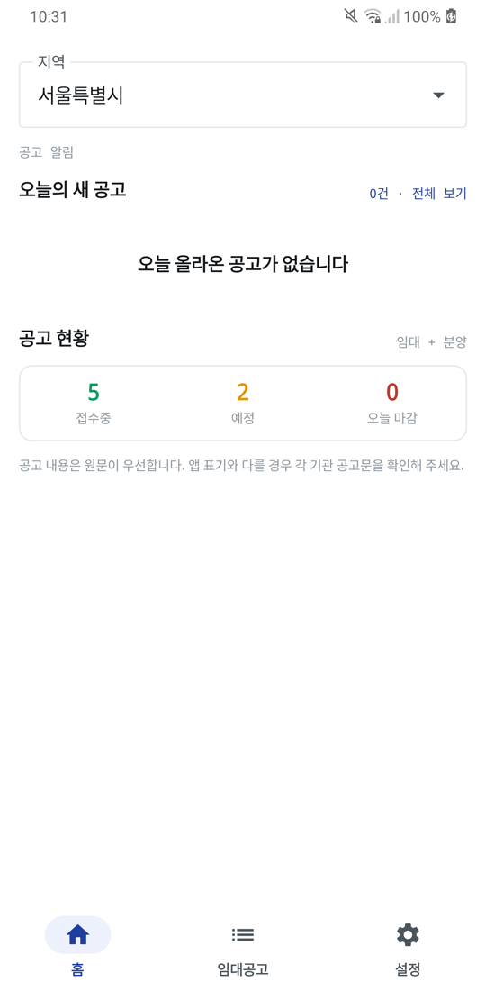
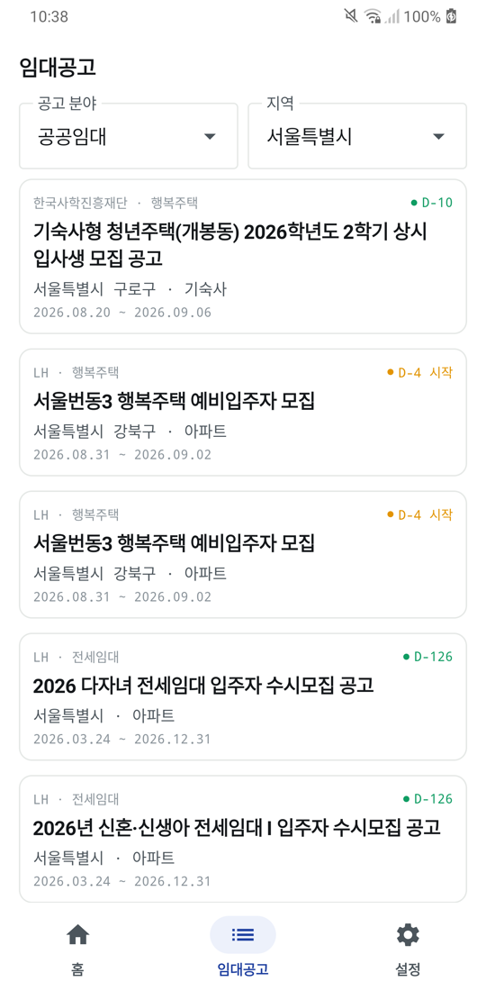
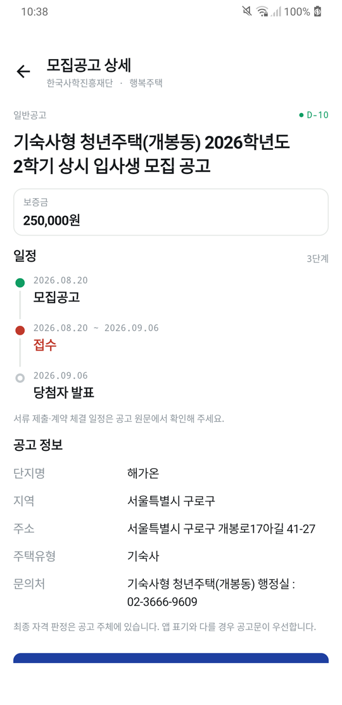
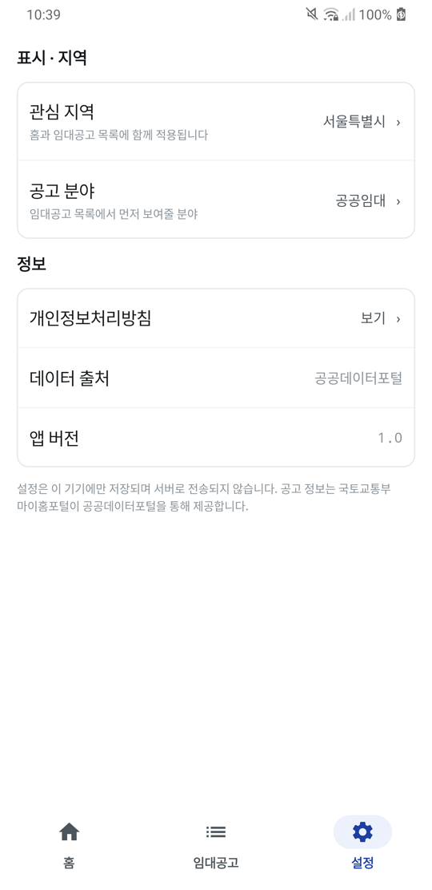

<div align="center">


# 청년의집

**흩어진 공고를 한곳에 받아보세요**

LH와 지방공사가 각자 올리는 공공임대·공공분양 모집공고를<br>지역별로 모아 보여주는 안드로이드 앱


 

</div>

---

## 화면

| 홈 | 임대공고 | 공고 상세 | 설정 |
|:--:|:--:|:--:|:--:|
|  |  |  |  |
| 오늘의 새 공고와 현황 | 지역·분야별 목록 | 일정과 공고 정보 | 지역·분야 지정 |

## 이런 걸 할 수 있습니다

### 내 지역 공고만
관심 지역을 한 번 고르면 홈과 임대공고 목록이 모두 그 지역 기준으로 정리됩니다. 공공임대·공공분양 분야도 따로 지정할 수 있습니다.

### 마감까지 남은 날
🟢 접수중, 🟠 접수 예정, 🔴 마감 임박을 색과 D-day로 구분해, 지금 챙겨야 할 공고가 바로 눈에 들어옵니다.

### 필요한 정보만 추려서
보증금·월 임대료, 접수부터 당첨자 발표까지의 일정, 단지 주소와 문의처를 한 화면에 정리합니다. 원문 공고로 바로 이동할 수 있습니다.

## 공고 정보의 출처

공고 정보는 **국토교통부 마이홈포털**이 **공공데이터포털(data.go.kr)** 을 통해 제공하는 공공데이터를 그대로 사용합니다.

> 공고 내용은 원문이 우선합니다. 앱 표기와 다를 경우 각 기관의 공고문을 확인해 주세요. 최종 자격 판정은 공고 주체에 있습니다.

## 개인정보를 수집하지 않습니다

- **계정이 없습니다** — 회원가입·로그인 없이 바로 공고를 볼 수 있습니다
- **설정은 기기 안에만** — 관심 지역과 공고 분야는 기기 내부에만 저장되고 서버로 전송되지 않습니다
- **추적하지 않습니다** — 분석 도구와 광고 SDK를 넣지 않았습니다

앱이 사용하는 권한은 `android.permission.INTERNET` 하나뿐입니다.

전문: [개인정보처리방침](https://myhome.mosstis.com/) · [앱 소개 페이지](https://myhome.mosstis.com/about.html)

## 기술 스택

| 영역 | 사용 기술 |
|---|---|
| 언어 · UI | Kotlin, Jetpack Compose (Material 3) |
| 아키텍처 | Clean Architecture (feature-first), MVVM, `BaseViewModel` + UiState/UiEffect |
| DI | Hilt (KSP) |
| 비동기 · 상태 | Coroutines, Flow, Paging 3 |
| 네트워크 | Retrofit 3, OkHttp 5, kotlinx.serialization |
| 로컬 저장 | DataStore Preferences |
| 빌드 | AGP 9, Gradle Version Catalog, R8 (release) |

- `minSdk` 24 · `targetSdk` 36 · `applicationId` `com.ams.youthhouse`
- 색상은 dynamic color 대신 고정 코발트 팔레트를 사용합니다. 접수중/예정/마감을 색으로 구분하기 때문입니다.

## 빌드

공공데이터포털 인증키가 필요합니다. `local.properties`에 아래 항목을 추가하세요.

```properties
DATA_GO_KR_SERVICE_KEY=발급받은_URL_인코딩_인증키
```

```bash
./gradlew installDebug
```

릴리즈 서명은 `keystore.properties`(VCS 제외)에서 `storeFile` / `storePassword` / `keyAlias` / `keyPassword`를 읽습니다. 파일이 없으면 debug 키로 서명되며, 그 번들은 Play에 업로드할 수 없습니다.

## 문의

개인 개발자 안명성 · [ms1994s@naver.com](mailto:ms1994s@naver.com)
